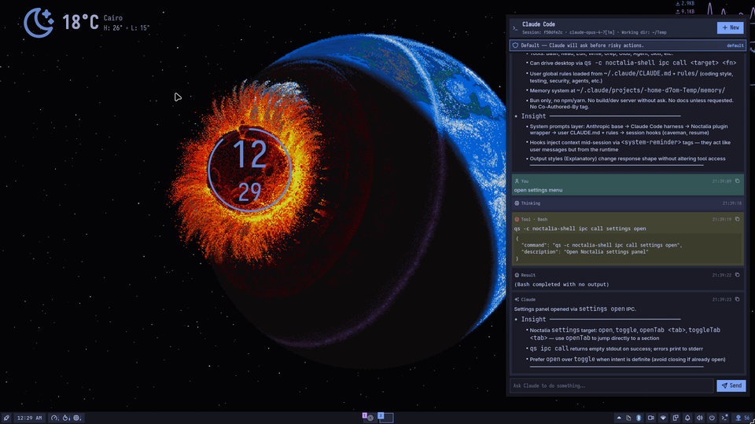

# Claude Code Panel — Noctalia Plugin



Run **Claude Code** (Anthropic's agentic CLI) inside your Noctalia shell, with full tool
access, session continuity, and built-in **Noctalia awareness**: Claude knows it's running
in your shell and can drive the desktop via `qs ipc call` directly.


---

## Features

| Feature | Implementation |
|---|---|
| Chat with Claude Code | `claude -p --output-format stream-json` per turn |
| Built-in tools (Bash, Read, Edit, Write, Glob, Grep, WebFetch, Task, …) | Native CLI |
| Session continuity | Captures `session_id`, resumes via `--resume` |
| Permission modes | `default` · `acceptEdits` · `plan` · `bypassPermissions` |
| Per-tool allow/deny | `--allowedTools` / `--disallowedTools` |
| Multi-directory access | `--add-dir` list |
| MCP servers | `--mcp-config <path>` + optional `--strict-mcp-config` |
| Model pinning + fallback | `--model` / `--fallback-model` |
| Custom system prompt | `--append-system-prompt` |
| **Noctalia context injection** | Baseline system prompt with full IPC surface (toggleable) |
| Danger mode | `--dangerously-skip-permissions` (gated behind confirmation) |
| IPC surface | `qs ipc call plugin:claude-code-panel <fn> [args]` |

---

## Requirements

- **Noctalia Shell ≥ 4.1.2** (`noctalia-qs`)
- **Claude Code CLI** — `npm install -g @anthropic-ai/claude-code`
- Authenticate it once: `claude` (Anthropic account, Bedrock, or Vertex)

The plugin never sees your Anthropic credentials — auth lives in `~/.claude/`.

---

## Installation

Open Noctalia's in-app plugin browser and search for **Claude Code Panel**, then install.

1. Enable **Claude Code Panel** in *Settings → Plugins*
2. Add the bar widget in *Settings → Bar*
3. Open the panel from the bar icon — or keybind it

<details>
<summary>Manual install</summary>

```bash
git clone --depth=1 https://github.com/noctalia-dev/noctalia-plugins /tmp/ncp \
  && cp -r /tmp/ncp/claude-code-panel ~/.config/noctalia/plugins/
```

Restart Noctalia (or reload plugins), then follow the steps above.
</details>

---

## Noctalia context injection (new in 0.1.1)

When `injectNoctaliaContext` is enabled (default **on**), every turn is prefixed with a
baseline system prompt that tells Claude:

- It's running inside the `claude-code-panel` plugin of **Noctalia Shell**.
- How to drive the desktop: `qs -c noctalia-shell ipc call <target> <function> [args...]`.
- The **full catalogue of IPC targets and functions** extracted from `IPCService.qml` —
  `bar`, `settings`, `notifications`, `brightness`, `darkMode`, `nightLight`, `volume`,
  `wallpaper`, `media`, `powerProfile`, `bluetooth`, `wifi`, `sessionMenu`, `lockScreen`,
  `launcher`, `systemMonitor`, `plugin`, and more — each with its function signatures.
- Conventions for the environment (no tilde expansion, argv-safe quoting, etc.).

Example — ask Claude *"turn on dark mode and set brightness to 30%"* and it will run:

```bash
qs -c noctalia-shell ipc call darkMode setDark
qs -c noctalia-shell ipc call brightness set 30
```

Your own `appendSystemPrompt` is still honoured — it's concatenated **after** the baseline
under a *User-provided instructions* heading.

To disable: `Settings → Session & Model → Inject Noctalia context` → off.

### Discovering IPC targets at runtime

Claude can call `qs ipc show` to list the live IPC surface of the running shell — useful
if you have extra plugins that register their own `IpcHandler`s.

---

## Permission flow

The panel has a **coloured banner** that always tells you what Claude is allowed to do:

| Banner | Mode | Meaning |
|---|---|---|
| Blue "Default" | `default` | Claude **asks the CLI** before risky tools |
| Orange | `acceptEdits` | File edits auto-apply; commands still prompted |
| Green "Plan" | `plan` | Claude can read + reason but cannot write or exec |
| **Red "Bypass"** | `bypassPermissions` or `--dangerously-skip-permissions` | No prompts |

Switching to bypass pops a confirmation. You can disable that gate in settings.

### Recommended starting configuration

- `permissionMode: "default"`
- `workingDir`: a specific project folder — **not `~`** (see troubleshooting below)
- `additionalDirs`: empty
- `allowedTools`: empty (CLI defaults will prompt)
- `dangerouslySkipPermissions: false`

---

## Slash commands

Type these in the input box (Enter to execute). Anything not in this list is passed
through to Claude itself — so `/compact`, `/cost`, `/config`, etc. still work.

| Command | Effect |
|---|---|
| `/help` | Show this list inline |
| `/clear` | Clear chat history (plugin-local; session preserved) |
| `/new` | Start a new Claude session |
| `/stop` | Stop the current run |
| `/model <name>` | Switch model |
| `/mode <default\|acceptEdits\|plan\|bypass>` | Change permission mode |
| `/cwd <path>` | Set working directory |
| `/dirs <p1,p2>` | Set additional readable dirs |
| `/allow <Tool1,Tool2>` | Replace `allowedTools` |
| `/deny <Tool1,Tool2>` | Replace `disallowedTools` |
| `/session` | Print current session id |
| `/copy` | Copy last assistant message |

---

## Plugin-level IPC

All plugin IPC targets are namespaced `plugin:claude-code-panel`.

```bash
qs -c noctalia-shell ipc call plugin:claude-code-panel toggle
qs -c noctalia-shell ipc call plugin:claude-code-panel open
qs -c noctalia-shell ipc call plugin:claude-code-panel close
qs -c noctalia-shell ipc call plugin:claude-code-panel send "Summarize this repo"
qs -c noctalia-shell ipc call plugin:claude-code-panel stop
qs -c noctalia-shell ipc call plugin:claude-code-panel clear
qs -c noctalia-shell ipc call plugin:claude-code-panel newSession
qs -c noctalia-shell ipc call plugin:claude-code-panel setModel claude-sonnet-4-6
qs -c noctalia-shell ipc call plugin:claude-code-panel setPermissionMode plan
qs -c noctalia-shell ipc call plugin:claude-code-panel setWorkingDir /home/me/project
```

### Keybinding examples

**Hyprland** — `~/.config/hypr/hyprland.conf`:
```conf
bind = SUPER, C, exec, qs -c noctalia-shell ipc call plugin:claude-code-panel toggle
```

**Niri** — `~/.config/niri/config.kdl`:
```kdl
binds {
    Mod+C { spawn "qs" "-c" "noctalia-shell" "ipc" "call" "plugin:claude-code-panel" "toggle"; }
}
```

**Sway** — `~/.config/sway/config`:
```conf
bindsym $mod+c exec qs -c noctalia-shell ipc call plugin:claude-code-panel toggle
```

---

## Settings reference

| Key | Type | Notes |
|---|---|---|
| `claude.binary` | string | Path or name of the CLI, default `"claude"` |
| `claude.workingDir` | string | Path to Claude's cwd. `~/` is expanded |
| `claude.model` | string | e.g. `claude-opus-4-7`. Empty → CLI default |
| `claude.fallbackModel` | string | Used on primary-model overload |
| `claude.permissionMode` | enum | `default` / `acceptEdits` / `plan` / `bypassPermissions` |
| `claude.allowedTools` | string[] | e.g. `["Read","Edit","Bash(git:*)"]` |
| `claude.disallowedTools` | string[] | e.g. `["Bash(rm:*)"]` |
| `claude.additionalDirs` | string[] | Extra dirs. `~/` is expanded |
| `claude.mcpConfigPath` | string | JSON file of MCP servers |
| `claude.strictMcpConfig` | bool | Only load servers from that file |
| `claude.injectNoctaliaContext` | bool | **New.** Inject Noctalia system prompt (default `true`) |
| `claude.appendSystemPrompt` | string | Your own additions, appended after baseline |
| `claude.includePartialMessages` | bool | Emit partial-token stream events |
| `claude.maxTurns` | int | Cap agent turns per run (0 = unlimited) |
| `claude.autoResume` | bool | Pass `--resume <sessionId>` automatically |
| `claude.dangerouslySkipPermissions` | bool | Root mode — disables all prompts |
| `claude.requireConfirmBypass` | bool | Gate bypass toggles behind a dialog |

---

## File layout

```
claude-code-panel/
├── manifest.json
├── Main.qml            # subprocess + state + IPC
├── Panel.qml           # chat UI + permission banner
├── BarWidget.qml       # bar toggle
├── Settings.qml        # configuration UI
├── ClaudeLogic.js      # pure helpers (command builder, stream-json parser, system prompt)
├── i18n/en.json
├── preview.png
└── README.md
```

---

## Security notes

1. **Plugin runs with your user privileges.** Claude in bypass mode is equivalent to
   giving a remote model a shell on your account. Scope `workingDir` to a project.
2. **Credentials live in the CLI, not the plugin.** The plugin only spawns `claude`.
3. **No shell injection surface.** The prompt, `workingDir`, `additionalDirs`, allowed
   tools, etc. are passed as **discrete argv elements** — no shell interpolation.
4. **State cache** at `$NOCTALIA_CACHE_DIR/plugins/claude-code-panel/state.json`: stores
   last session id, message history, input draft. **No API keys.**

---

## Troubleshooting

### Process fails to start with *"binary could not be found"*

Qt's `QProcess` reports every pre-exec failure (missing binary, failed `chdir`, bad
permissions) as the same `FailedToStart` enum — the message always reads *"not found"*.

**Most common cause:** `workingDir` or an entry in `additionalDirs` uses a literal `~`
that your shell would normally expand. `QProcess` does **not** expand tildes. 0.1.1
expands leading `~/` internally; older versions must use absolute paths.

**Second most common cause:** the binary path doesn't exist, isn't executable, or its
dynamic-linker interpreter (`/lib64/ld-linux-x86-64.so.2`) is missing.

**Diagnosis:**
```bash
file "$(which claude)"
readlink -f "$(which claude)"
ldd "$(readlink -f "$(which claude)")" | head
```

### Settings panel renders empty

Reload the plugin. If it persists, check the Noctalia log for QML parse errors — each
line prints the offending file and line number.

### Runs exit immediately with no output

Run the exact command you see in the Noctalia log manually in a terminal; the CLI's own
error will tell you what it wants (usually authentication).

### Session IDs rotate

Claude Code sometimes returns a new `session_id` in the `result` event. The plugin
captures it automatically.

---

## Speed

Per-turn invocation pays a Node/MCP bootstrap cost on every message. Partial-message
streaming (`--include-partial-messages`) is on by default so tokens appear live.
Persistent-mode (`--input-format stream-json` over stdin) is plumbed but gated behind a
Quickshell `stdinEnabled` bug — will flip on once that lands upstream.

Any change that affects the command line (model, permission mode, working dir, tool
allow/deny, MCP config, …) restarts the process on the next turn automatically.

---

## Contributing

PRs welcome against [`noctalia-dev/noctalia-plugins`](https://github.com/noctalia-dev/noctalia-plugins).
`ClaudeLogic.js` is pure and unit-testable with node: strip the leading `.pragma library`,
`require('vm')` it into a clean context, and call `buildPerTurnCommand` directly.

## License

MIT
