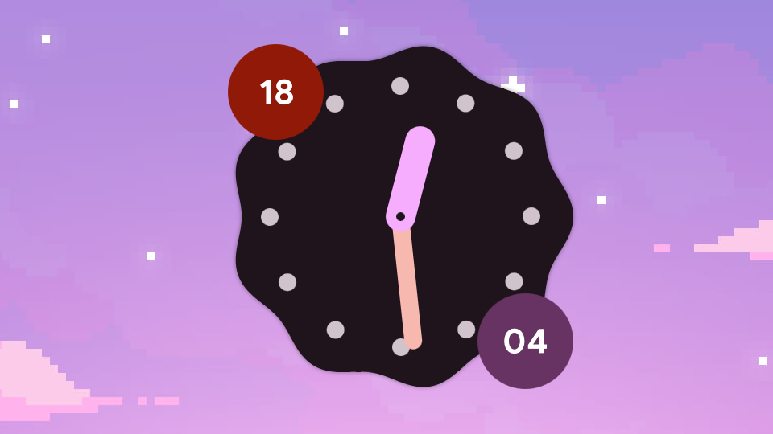

# Cookie Clock for Noctalia Shell

A simple desktop clock widget. Trying to be port of the Illogical Impulse's cookie styled clock.



# Manual Installation

Requires `git`

```
git clone https://github.com/elrondforwin/noctalia-cookie-clock.git ~/.config/noctalia/plugins/cookie-clock
```

# License

GPL-3.0

# Credits

Inspiration and lots of code from [end4's Illogical Impulse](https://github.com/end-4/dots-hyprland)
