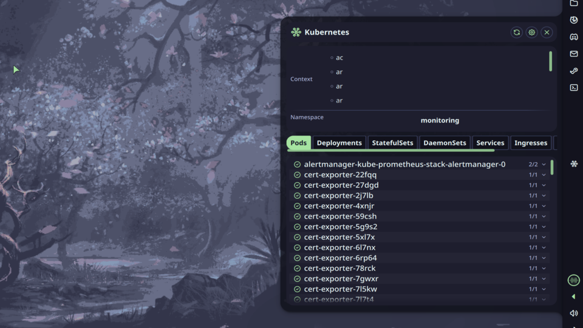

# Kubectl Context



Kubernetes context and namespace switcher with resource browser powered by `kubectl`.

## Features

- **Bar Widget**: Shows active context and namespace. Icon turns red when any pod is in Error or CrashLoopBackOff state
- **Control Center Widget**: Quick access button to toggle the panel
- **Panel**: Switch contexts and namespaces, browse cluster resources across 8 resource types
- **Resource Browser**: View Pods, Deployments, StatefulSets, DaemonSets, Services, Ingresses, ConfigMaps and Secrets
- **Resource Actions**: Copy name, describe, view logs, restart (Deployments/StatefulSets), delete with confirmation
- **OIDC Support**: Automatically prepends `~/.krew/bin` to PATH for OIDC and other krew plugins

## How It Works

The plugin runs `kubectl` commands in the background to fetch contexts, namespaces and resources. All data is refreshed at a configurable interval and automatically after context or namespace switches. The active context and namespace are read from kubeconfig.

Logs and describe output are opened in a terminal emulator. The terminal is kept open after the command exits so you can read the output.

## Usage

- **Bar widget**: Left click to open panel, right click for settings menu
- **Context switcher**: Click a context to switch to it
- **Namespace switcher**: Click the dropdown button to open the namespace list, type to filter, use arrow keys and Enter to select
- **Resource tabs**: Click a tab to browse that resource type
- **Resource row**: Click a row to expand action buttons (Copy name, Describe, View logs, Restart, Delete)

## Settings

| Setting | Default | Description |
|---|---|---|
| Kubeconfig path | `~/.kube/config` | Path to kubeconfig file. Leave empty to use default |
| Terminal emulator | `$TERMINAL` | Terminal used for describe/logs commands. Leave empty to use `$TERMINAL` |
| Poll interval | 60 s | How often to refresh data from the cluster |
| Show error badge | true | Show a red badge on the bar widget when a pod is in Error or CrashLoopBackOff state |
| Icon color | None | Color of the bar widget icon |
| Panel width | 620 px | Width of the panel window |
| Panel height | 680 px | Height of the panel window |

## IPC Commands

```bash
# Toggle panel
qs -c noctalia-shell ipc call plugin:kubectl-ctx toggle

# Refresh contexts and resources
qs -c noctalia-shell ipc call plugin:kubectl-ctx refresh
```

## Requirements

- `kubectl` installed and available in `PATH`
- Valid kubeconfig at `~/.kube/config` or configured via settings
- A terminal emulator for describe/logs functionality (kitty, ghostty, alacritty, foot, etc.)
- For OIDC clusters: `kubectl-oidc_login` installed via krew (`~/.krew/bin`)
