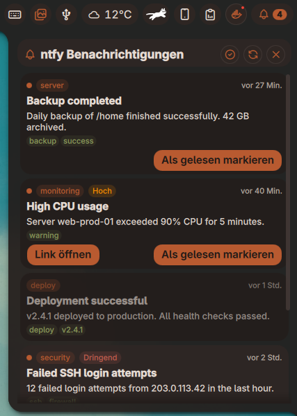

# ntfy Notifications Plugin

Receive push notifications from [ntfy](https://ntfy.sh) directly in your Noctalia bar. Subscribe to topics on the public ntfy.sh server or your own self-hosted instance.



## Features

- **Bar Widget:** Bell icon with unread message badge and pulse animation
- **Panel:** Scrollable notification list with topic badges, priority indicators, timestamps, and tags
- **Desktop Toasts:** Native Noctalia toast notifications on new messages
- **Read Status:** Mark messages individually or all at once as read (persists across restarts)
- **Authentication:** Supports public topics, Access Token, and Basic Auth (username/password)
- **Custom Server:** Use ntfy.sh or any self-hosted ntfy instance
- **Multiple Topics:** Subscribe to multiple topics at once (comma-separated)
- **Theming:** Fully themed using Noctalia's N* widgets, works with light and dark themes
- **IPC:** Refresh via CLI: `qs ipc call plugin:ntfy-notifications refresh`

## Installation

1. Install via the Noctalia plugin manager, or clone into your plugins directory
2. Add the bar widget to your bar configuration
3. Right-click the widget → Settings
4. Enter your topic(s) and optionally configure server URL and authentication

## Configuration

| Setting | Default | Description |
|---------|---------|-------------|
| Server URL | `https://ntfy.sh` | ntfy server base URL |
| Topics | *(empty)* | Comma-separated topic names (e.g. `alerts,backups`) |
| Authentication | None | `None`, `Access Token`, or `Username & Password` |
| Poll Interval | 30s | How often to check for new messages (15–3600s) |
| Desktop Notifications | On | Show toast when new messages arrive |
| Max Messages | 100 | Maximum messages kept in history (10–500) |

## IPC Commands

```bash
# Refresh messages now
qs ipc call plugin:ntfy-notifications refresh

# Toggle panel
qs ipc call plugin:ntfy-notifications toggle
```

## How It Works

The plugin polls the ntfy API using HTTP GET requests with `?poll=1&since=<timestamp>`. This retrieves new messages since the last check without keeping a persistent connection. Messages are parsed from ntfy's NDJSON response format.

## Privacy

- The plugin only communicates with the configured ntfy server
- No data is sent to third parties
- Authentication credentials are stored locally in Noctalia's plugin settings

## License

MIT
